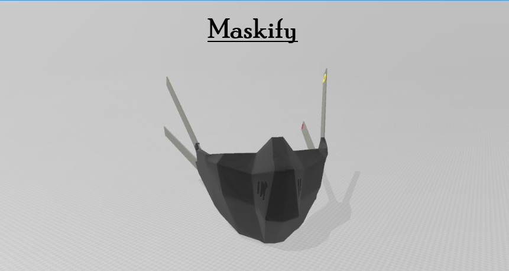
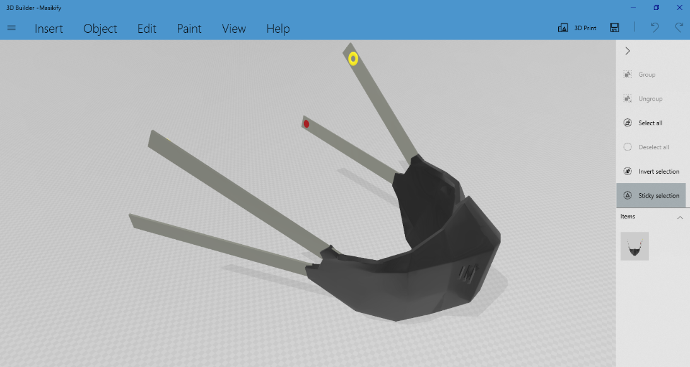
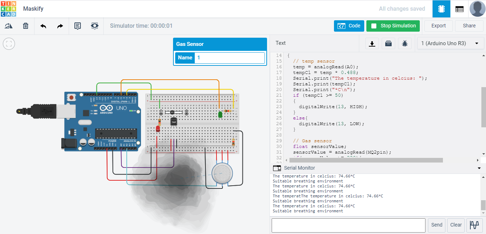

# Maskify
Your personal health and entertainment assistant

## Inspiration
We know that mask is one of the most important things that we need now, but it's been more than a year now there are still people not wearing masks and there is nothing much improvement in this thing to come up with something revolutionary that can make wearing masks a whole lot of fun at the same time beneficial. A lot of people find it difficult to wear a mask and talk, at this point in time when personal health is most important, people fail to take care of themselves because they are not aware of their most recent body vitals and bad things can happen. People talk on phones or listen to music while walking on the road and accidents happen. These things inspired me the most to come up with something that will make people wear masks without even telling them to wear it with a whole lot of new features, duh, It is fun to wear masks now thanks to our prototype.

## What does it do
We have come up with a prototype that changes the way and thinking about wearing masks. We have built a 3D model of the mask that we wish to make which will demonstrate our idea very well. Maskify can monitor your major health parameters like heart rate and temperature while you are wearing the mask and can give you real-time vitals on the mobile application that we have built with just a click. It also alerts the user regarding any abnormality in the vitals and suggests you to take the necessary measures. It also has a toxic gas detector which informs the user whether it is a safe place for the user to be in which the user may not know and can be saved from any type of harmful effects. Now to make the user more willing to wear a mask, we have made a speaker inbuilt in the mask strap similar to earphones, but this speaker is built using the bone conduction method by which there will be nothing that you would need put in your ears unlike the earphones and the person will be able to hear sound through the earbones. One advantage of using this is that the ears will be free and it makes it safe for people to wear it outside because now you will be aware of the traffic and hence no accidents.

## How we built it
The 3d model of our prototype is built using the 3d builder software in windows. Since our project consists of hardware that and we did not have hardware components we did it using tinkercad. We built the app using the MIT app inventer and the voice translation using the Google translate api.

## Challenges Faced
There were a lot of challenges that we faced during the entire event. First and more most is the team formation. Our team consists of two people and we did not know each other and we had to spend a lot of time to find a proper team and finally start working on a project that would do good to people. Secondly, since we were doing a hardware hack and we did not have components with us we had to make all the simulations on Tinkercad as suggested by the organizers and the mentors and it was completely new platform which took a lot of time to get familiar with and there were some sensors not available which made hardware simulations more difficult. We had to build a 3d model and none of us were familiar with any software for it, finally I had to spend hours to find out how 3d builder software works and finally build a complete model as desired. None of us knew app development but the project we were building required an app so we used MIT app inventer which was again the first time we were using that after many ups and downs we managed to complete the app with complete cloud connectivity. It was also first time using Google translate api and there were numerous errors that came but we managed to figure it out and get things working. 
In short, it  was a real bumpy ride throughout the entire hackathon but this ride turned out to be successful in what we wanted to build, provided with the limit of two people and of course, technical issues here and there. Yet, we persevered! 

## Illustrations

## Accomplishments we are proud of
1. We're very happy with our production of ideas and visualizations for the limited amount of time and hardware we had.
2. We learnt a lot about our own capabilities and overcame a lot of fears along the way. Most importantly, building something from scratch in two days without knowing most of the things like 3D modelling, app dev, Tinkercad, etc is the best achievement from this journey
3. Though we were very new to autocad, but it turned out to be very successful in being both clean, atheistically pleasing and practical.
Whatever we built during the hackathon was completely new for us, it took sometime to figure things out but still we were able to build what we wanted which we are really proud of.

## What we learned 
As mentioned above, during this entire period everything we did was completely new for us. We learned autocad, app development in MIT app inventer, using google apis, online hardware simulation using Tinkercad.

## Future Aspects
1. We would like to add more features like voice assistant by which the user can access all the features of the mask using voice commands like getting the vitals, controlling the speaker for calls or for music.  
2. In addition, we would like to create a device which is much cheaper to further increase practicality because now we had access to very limited hardware.
3. Some of our ideas weren't implemented as flexible as we would have liked, and we are excited to address those shortcomings.
We are optimistic that perhaps a version of this product will reach the market one day.

## What did we build it with
There are separate parts of our project. We built the 3D model in 3D builder software available on windows since it was comparatively easy to start building as compared to any other platform as this was the first time we did this. We used Tinkercad for hardware simulations and MIT app inventer for creating an app. We made the language translator using the Google cloud api and the cloud IoT platform we used is thinkspeak.
